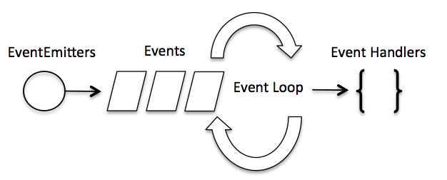

# Event loop
## Event loop ?
* Node js là một ứng dụng đơn luồng nhưng có hỗ trợ xử lý đồng thời thông qua callback
* Tất cả các API của node js là đơn luồng và không đồng bộ  ==> sử dụng aync để duy trì sự đồng thời

## Lập trình Event Driven 
* Node js khởi động khai báo các biến, hàm ngay khi khởi động ServerServer ==> chờ các sự kiện xảy ra
* Trong ứng dụng xử lý sự kiện nhìn chung vòng lặp lắng nghe sự kiện ==> trigger event ==> callback
*

* Làm việc thông qua module eventsevents và lớp EventEmitter
```js
// Khai báo module event
let events = require('events')

// Khai báo đối tượng của EventEmitter
let eventEmitter = new events.EventEmitter()

// Tạo một event handler
let eventHandler = function connected(){
  console.log('Kết nối thành công')
  // Lúc này đối tương eventEmitter kích hoạt sự kiện nhận dữ liệu
  eventEmitter.emit('data_received')
  }
// Gắn sự kiện  cho event Handler  VD: sự kiện connection
eventEmitter.on('connection', eventHandler)
// Gắn sự kiện nhận kết nối với hàm ẩn danh trả về kết quả
eventEmitter.on('data_received', function (){
  console.log('Du lieu duoc tiep nhan thanh cong.');
  })
// Cuối cùng kích hoạt sự kiện connection
eventHandler.emit('connection')
console.log('end')

```
### Event Emiter
[Link http://vietjack.com/nodejs/lop_event_emitter_trong_nodejs.jsp](http://vietjack.com/nodejs/lop_event_emitter_trong_nodejs.jsp)